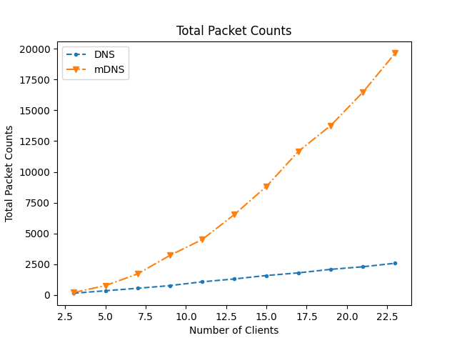
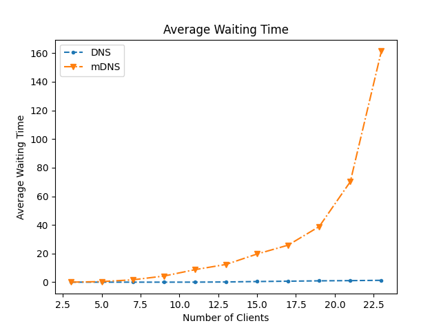
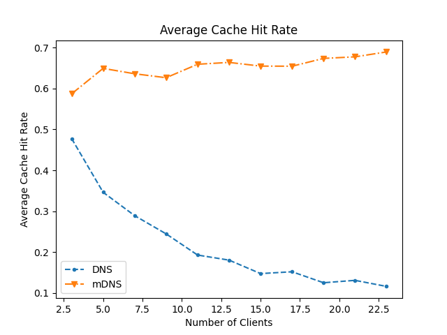

# Performance Comparison for DNS and mDNS
This is a simulation built with SimPy to compare the performance
of DNS and multicast DNS (mDNS) in a local network.

# Get Started
Create a virtual environment and clone this repo
```shell
git clone https://github.com/Larryun/dns-mdns-simulation
pip install -r requirements.txt
```

# Parameters
The following time is measured in number of timestep in SimPy
```shell
SIMULATION_TIME = 10000

# Device
DEVICE_QUEUE_SIZE = 10

# Link
LINK_TRANS_TIME = 5
LINK_PACKET_CAPACITY = 10
LINK_BACKOFF_TIME = 1

# DNS entry expiration time
ENTRY_EXPIRATION_TIME = 500
QUERY_INTERVAL = 150

# DNS client processing time
CLIENT_PROCESS_TIME = 5
DNS_SERVER_PROCESS_TIME = 5
```


# Result
The current simulation collected the following metrics during the simulation. 
- Total Packet Counts
- Average Waiting Time
- Average Cache Hit Rate

### Total Packet Counts
Total packets counts is the number of packets of all type of packet that is transmitted over the link. 
The simulation indicates that total packet counts growth exponentially in mDNS whereas DNS growth
linearly. The result make sense since mDNS sends N-2 more query packets compare to unicast for every query. 


### Average Waiting Time
Average waiting time is the average time of all client waited when trying to send a packet
over the link. Since we model link to be limited by some number of packet that can be on the link at the same
time, as a result mDNS also growth exponentially.



Average Cache Hit Rate is calculated by `cache_hit / query_count`. The following results indicates 
that mDNS has much higher cache hit rate compared to DNS which degrades as the number of clients increases.
This also means that a high cache hit rate does not necessary implies higher performance in mDNS since 
the cost of a cache miss is much higher. In the case of mDNS, a cache miss could lead to a query of N-1 packets 
and N-1 answer packet to be delivered over the link in our model. Whereas only 1 query packet and 1 respond packet
need to delivered over the link in standard DNS.


